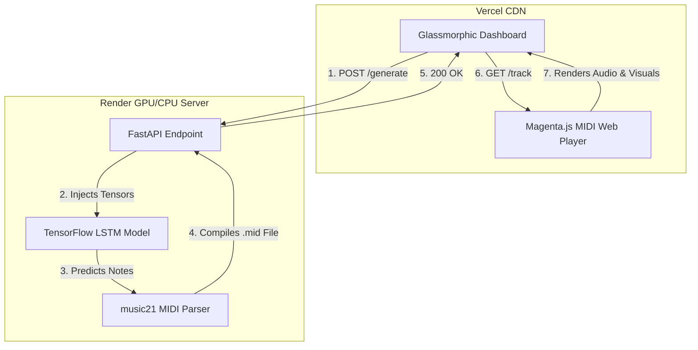

# 🎵 NeuroComposer: AI Orchestration Engine

NeuroComposer is an advanced, full-stack Artificial Intelligence application that composes original classical piano music based on emotional input (Mood) and numerical variance (Creativity/Tempo). 

Built with a deep learning LSTM (Long Short-Term Memory) neural network, the system parses complex MIDI structures into mathematical tensors, predicts logical harmonic sequences, and synthesizes them into downloadable, professional-grade `.mid` files for Digital Audio Workstations (DAWs).

**Live Demo:** [neurocomposer.vercel.app](https://neurocomposer.vercel.app)

---

## ✨ Core Features
- **🧠 LSTM Neural Network:** A deep sequential model trained on the Google Magenta MAESTRO Dataset to predict complex chord progressions and melodies.
- **🎛️ Dynamic API Routing:** The frontend natively switches between `localhost` for development and production domains during deployment.
- **🎚️ Mathematical Tempo Control:** Real-time Beats Per Minute (BPM) injection into the final MIDI bytecode.
- **🎛️ Temperature (Creativity) Sampling:** Logarithmic probability adjustment allowing the user to make the AI play it safe (classical) or chaotic (experimental).
- **🌊 3D Waterfall Visualization:** A stunning, glassmorphic UI equipped with a real-time cascading MIDI visualizer powered by Magenta.js.

---

## 🏗️ Architecture

NeuroComposer operates on a decoupled "Split Deployment" architecture, allowing the deep learning API and the interactive dashboard to scale independently.



---

## 🚀 Quick Start (Local Deployment)

Want to run the neural network on your own machine?

### 1. Clone the Repository
```bash
git clone https://github.com/Suyogya-Tiwari/Affective-music-ai.git
cd Affective-music-ai
```

### 2. Boot the AI Backend
```bash
pip install -r requirements.txt
python -m uvicorn api.main:app --reload
```

### 3. Boot the Dashboard
Open a second terminal and host the static files:
```bash
cd frontend
python -m http.server 3000
```
Open `http://localhost:3000` in your browser!
