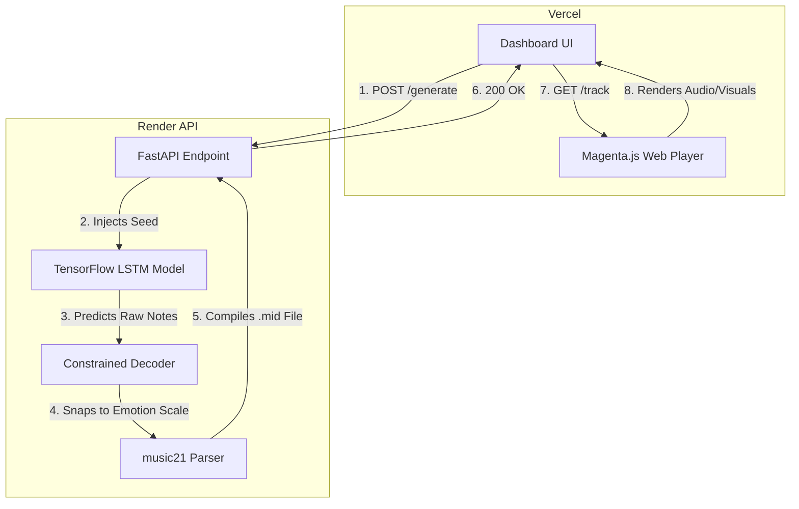

# NeuroComposer

NeuroComposer is a full-stack web application that uses a deep learning LSTM (Long Short-Term Memory) neural network to generate classical piano music based on selected emotion and tempo constraints.

The model is trained on the Lakh MIDI Dataset. The backend parses MIDI data into tensors, predicts note sequences, and generates downloadable `.mid` files for use in Digital Audio Workstations (DAWs).

**Application Link:** [neurocomposer.vercel.app](https://neurocomposer.vercel.app)

---

## Technical Features
- **LSTM Neural Network:** A sequential model trained on 2,500+ classical tracks to predict chord progressions and melodies.
- **Constrained Decoding:** A heuristic mathematical filter that intercepts the model's raw output and snaps predicted notes into the specific music theory scale of the requested emotion (e.g., C Minor for Sad, C Lydian for Dreamy).
- **MIDI Heuristics:** Dynamically adjusts MIDI Control Change (Sustain Pedal) and note velocities based on emotion parameters to simulate human playback.
- **Temperature Sampling:** Logarithmic probability adjustment allowing users to control the variance (creativity) of the generated sequences.
- **Web Interface:** A frontend application featuring real-time MIDI visualization powered by Magenta.js.

---

## Architecture

The application uses a decoupled frontend/backend architecture.


```mermaid
graph TD
    subgraph Frontend ["Vercel"]
        UI["Dashboard UI"]
        Player["Magenta.js Web Player"]
    end

    subgraph Backend ["Render API"]
        API["FastAPI Endpoint"]
        Filter["Constrained Decoder"]
        Music21["music21 Parser"]
        Brain["TensorFlow LSTM Model"]
    end

    UI -->|"1. POST /generate"| API
    API -->|"2. Injects Seed"| Brain
    Brain -->|"3. Predicts Raw Notes"| Filter
    Filter -->|"4. Snaps to Emotion Scale"| Music21
    Music21 -->|"5. Compiles .mid File"| API
    API -->|"6. 200 OK"| UI
    UI -->|"7. GET /track"| Player
    Player -->|"8. Renders Audio/Visuals"| UI
```

---

## Local Development

### 1. Clone the Repository
```bash
git clone https://github.com/Suyogya-Tiwari/Affective-music-ai.git
cd Affective-music-ai
```

### 2. Install Dependencies
```bash
pip install -r requirements.txt
```

### 3. Run the Application
```bash
python run_app.py
```
